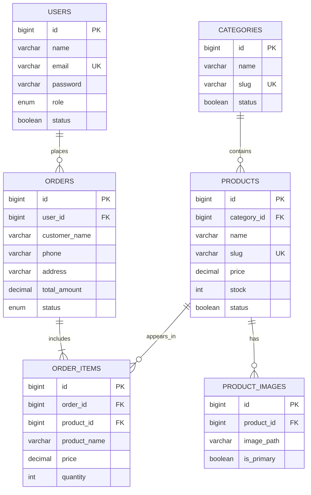

# Sơ đồ cơ sở dữ liệu

`order_items` lưu lại tên và giá sản phẩm tại thời điểm mua để lịch sử đơn hàng không bị thay đổi khi quản trị viên cập nhật sản phẩm. Doanh thu được tính từ `orders.total_amount` với trạng thái `completed`.
